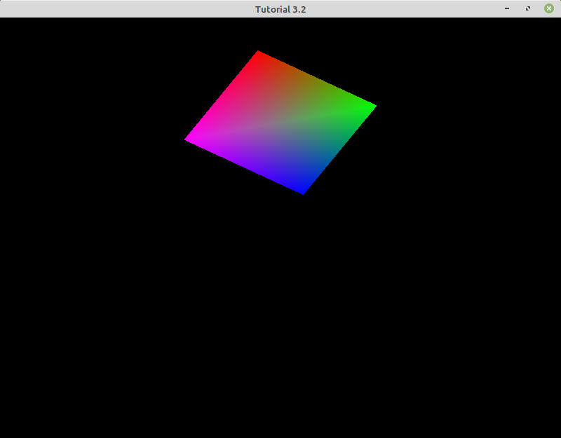
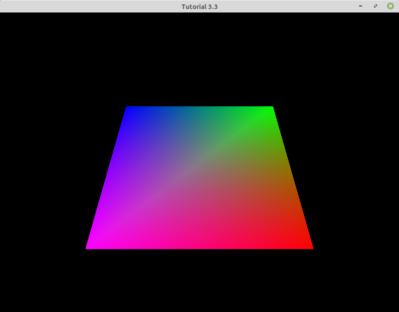
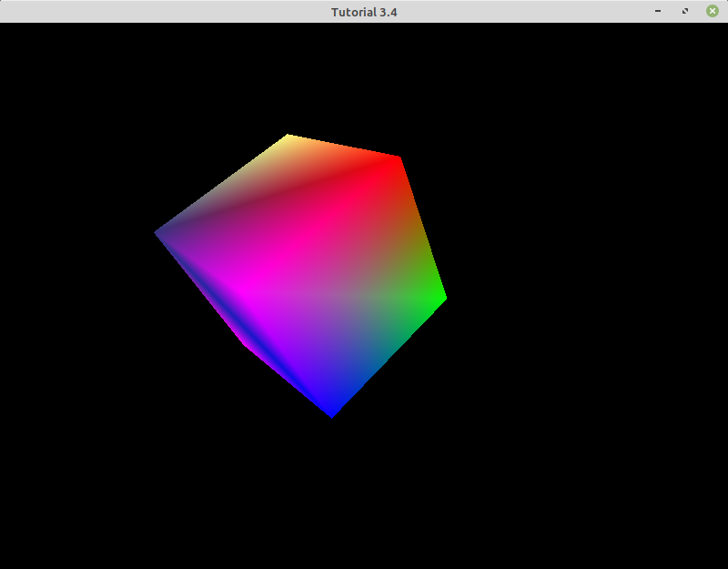
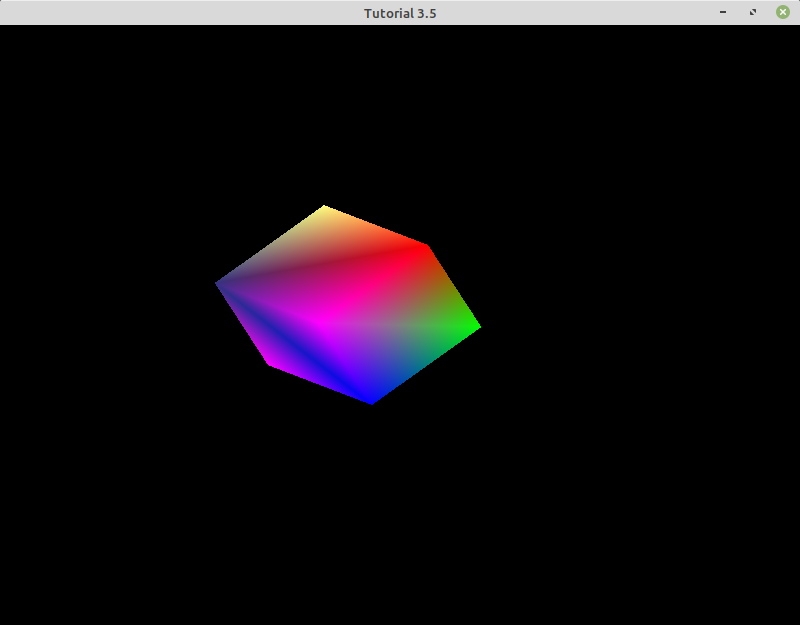

# Section 3-1: Introduction to GLM

Computer graphics applications normally require a fair amount of mathematical operations. Therefore, if you are developing an application with C++ and OpenGL, a great library to be familiar with is GLM, which stands for OpenGL Mathematics. The OpenGL part of the name comes from the fact that it is based on the OpenGL Shading Language (GLSL) specifications.

GLM is a header-only library, which means that there are no precompiled libraries. In order to use it, you just need to include the appropriate header files. Pay attention to the include section of the next few tutorials and make sure to visit GLM's reference pages to start learning what it can do and how to use it.


# Section 3-2: Transforming an Object using the Model Matrix

The code for this section ([tut_03_02.cpp](./tut_03_02.cpp)) demonstrates how to

* translate, rotate and scale an object using the model matrix and uniform variables 

The following image shows the final result:



Continuing with tutorial 2.8, we modify the `UCreateMesh` function to create a square (instead of a triangle).

    // Specifies normalized device coordinates (x,y, z) and color for square vertices
    GLfloat verts[]=
    {
    // Vertex Positions    // Colors
     0.5f,  0.5f, 0.0f,   1.0f, 0.0f, 0.0f, 1.0f, // Top Right Vertex 0
     0.5f, -0.5f, 0.0f,   0.0f, 1.0f, 0.0f, 1.0f, // Bottom Right Vertex 1
    -0.5f, -0.5f, 0.0f,   0.0f, 0.0f, 1.0f, 1.0f, // Bottom Left Vertex 2
    -0.5f,  0.5f, 0.0f,   1.0f, 0.0f, 1.0f, 1.0f  // Top Left Vertex 3
    };

 In function `URender`, we build the `transformation` matrix that represents the affine transformation resulting from

1. Scaling the square to half its original size
2. Rotating it by 45 degrees in the z axis
3. Translating it by 0.5 in the y axis

All of these three transformations are represented by a 4x4 homogeneous matrix. Also, transformations are applied right to left, so if scaling needs to occur first, it will have to be the rightmost matrix.

After the `transformation` matrix has been calculated, we need to pass it to the vertex shader as a `uniform`. Uniform variables are per-mesh attributes -- i.e. they are shared by all vertices. In order to transfer this matrix as a uniform, we 

1. Retrieve the uniform's location (in memory) within the active program by calling `glGetUniformLocation`
2. We transfer the data by calling `glUniformMatrix4fv` (note that there is a large collection of `glUniform` matrices, so make sure to review their reference pages) 

```
void URender()
{
    // Clear the background
    glClearColor(0.0f, 0.0f, 0.0f, 1.0f);
    glClear(GL_COLOR_BUFFER_BIT);

    // 1. Scales the shape down by half of its original size in all 3 dimensions
    glm::mat4 scale = glm::scale(glm::vec3(0.5f, 0.5f, 0.5f));

    // 2. Rotates shape by 45 degrees on the z axis
    glm::mat4 rotation = glm::rotate(45.0f, glm::vec3(0.0f, 0.0f, 1.0f));

    // 3. Translates by 0.5 in the y axis
    glm::mat4 translation = glm::translate(glm::vec3(0.0f, 0.5f, 0.0f));

    // Transformations are applied right-to-left order
    glm::mat4 transformation = translation * rotation * scale;

    // Set the shader to be used
    glUseProgram(gProgramId);

    // Sends transform information to the Vertex shader
    GLuint transformLocation = glGetUniformLocation(gProgramId, "shaderTransform");
    glUniformMatrix4fv(transformLocation, 1, GL_FALSE, glm::value_ptr(transformation));

    // Activate the VBOs contained within the mesh's VAO
    glBindVertexArray(gMesh.vao);

    // Draws the triangle
    glDrawElements(GL_TRIANGLES, gMesh.nIndices, GL_UNSIGNED_SHORT, NULL); // Draws the triangle

    // Deactivate the Vertex Array Object
    glBindVertexArray(0);

    // glfw: swap buffers and poll IO events (keys pressed/released, mouse moved etc.)
    glfwSwapBuffers(gWindow);    // Flips the the back buffer with the front buffer every frame.
}
```

The fragment shader will remain unchanged, but the vertex shader now has to declare this uniform variable matrix, and use it to transform the incoming vertex position.

    layout (location = 0) in vec3 position; // Vertex data from Vertex Attrib Pointer 0
    layout (location = 1) in vec4 color;  // Color data from Vertex Attrib Pointer 1

    out vec4 vertexColor; // variable to transfer color data to the fragment shader

    uniform mat4 shaderTransform; // 4x4 matrix variable for transforming vertex data

    void main()
    {
        gl_Position = shaderTransform * vec4(position, 1.0f); // transforms vertex data using matrix
        vertexColor = color; // references incoming color data
    }

and the fragment shader

    in vec4 vertexColor; // Variable to hold incoming color data from vertex shader

    out vec4 fragmentColor;

    void main()
    {
        fragmentColor = vec4(vertexColor);
    }


Note how, before multiplying the vertex position by the transformation, we convert it to a 4-dimensional vector, with a `1.0` as the fourth coordinate. We do this so we can work in homogenous coordinates.

### Exercise

Try changing the parameters that create the scale, rotation and translation matrices (in `URender`). First try changing each one of them independently (e.g. first the scale matrix, then the rotation...), and then try to combine them.


# Section 3-3: Combining the Model, View, and Projection Matrices

The code for this section ([tut_03_03.cpp](./tut_03_03.cpp)) demonstrates how to

* create a model matrix
* create a view matrix
* create a projection matrix using GLM's `perspective` function
* combine the model, view and perspective projection matrices

The following image shows the final result:



All of the changes from the previous tutorial are confined to the vertex shader and the `URender` function

## The Model Matrix

Up until this point we have described the coordinates of the vertices of our primitives (a triangle and a square) in the _normalized device coordinate system_. This was required since we had yet to introduce the model matrix. From this point forward, the vertex locations (in `UCreateMesh`) are in _local coordinates_ (or _local space_). Remember that the model matrix is a 4x4 matrix that transforms points and vectors -- expressed in homogeneous coordinates -- from the object's _local space_ into _world space_.

We build the model matrix in the `URender` function. This time we have changed the scale transformation to enlarge the square, and the rotation matrix to rotate around the x axis.

    // 1. Scales the object by 2
    glm::mat4 scale = glm::scale(glm::vec3(2.0f, 2.0f, 2.0f));
    // 2. Rotates shape by 15 degrees in the x axis
    glm::mat4 rotation = glm::rotate(15.0f, glm::vec3(1.0, 0.0f, 0.0f));
    // 3. Place object at the origin
    glm::mat4 translation = glm::translate(glm::vec3(0.0f, 0.0f, 0.0f));
    // Model matrix: transformations are applied right-to-left
    glm::mat4 model = translation * rotation * scale;

## The View Matrix

The view matrix transforms the vertex locations from the _world space_ into the _view space_. The view matrix is, like the model matrix, a 4x4 matrix. In this example, we translate the camera backwards by 3 units.

    glm::mat4 view = glm::translate(glm::vec3(0.0f, 0.0f, -3.0f));

## The Projection Matrix

There are two basic types of projections that we can apply: perspective and orthographic. In this example, we are going to create a perspective projection matrix -- which mimics how the eye (and real cameras) work. To build this 4x4 matrix, we use GLM's `perspective` function:

    glm::mat4 projection = glm::perspective(45.0f, (GLfloat)WINDOW_WIDTH / (GLfloat)WINDOW_HEIGHT, 0.1f, 100.0f);

The first parameter is the field-of-view; the second one is the aspect ratio; the third one is the distance of the _near plane_ to the camera; and the last parameter is the distance of the _far plane_ to the camera. Points on the surfaces of objects that are closer to the camera than the near plane, or farther than the far plane, will be _clipped_.

## Combining the Model, View and Projection Matrices

All three matrices are transferred to the vertex shader as uniform variables:

    // Retrieves and passes transform matrices to the Shader program
    GLint modelLoc = glGetUniformLocation(gProgramId, "model");
    GLint viewLoc = glGetUniformLocation(gProgramId, "view");
    GLint projLoc = glGetUniformLocation(gProgramId, "projection");

    glUniformMatrix4fv(modelLoc, 1, GL_FALSE, glm::value_ptr(model));
    glUniformMatrix4fv(viewLoc, 1, GL_FALSE, glm::value_ptr(view));
    glUniformMatrix4fv(projLoc, 1, GL_FALSE, glm::value_ptr(projection));

And the vertex shader combines them, and multiplies the vertex location with it. Remember that matrix transformations are applied right-to-left, so the model matrix (being the first transformation) will be on the right.

    layout (location = 0) in vec3 position; // Vertex data from Vertex Attrib Pointer 0
    layout (location = 1) in vec4 color;  // Color data from Vertex Attrib Pointer 1

    out vec4 vertexColor; // variable to transfer color data to the fragment shader

    //Global variables for the  transform matrices
    uniform mat4 model;
    uniform mat4 view;
    uniform mat4 projection;

    void main()
    {
        gl_Position = projection * view * model * vec4(position, 1.0f); // transforms vertices to clip coordinates
        vertexColor = color; // references incoming color data
    }


### Exercise

Play with the parameters to the view and the perspective projection matrices.

1. Move the camera to the left by 1 unit. Which coordinate did you modify? Next, move the camera to the right by 1 unit. Which coordinate did you modify? Keep increasing the offset (right or left) and determine at what point the cube disappears completely.
2. Try changing the Z axis for the camera. What happens when you increase or decrease the value?
3. Change the field of view of the perspective projection (remember this includes four parameters including field of view, aspect ratio, near, and far). What happens when you make the field of view very large? Does the object appear larger or smaller?
4. Move the near plane farther away from the camera. At what point does the cube start to disappear? Remember that the square is centered at the origin, and that the camera is moved backwards by 3 units.


# Section 3-4: Creating and Displaying a Cube

The code for this section ([tut_03_04.cpp](./tut_03_04.cpp)) demonstrates how to

* Enable and clear the Z-buffer
* Create a cube



## A Cube Mesh

In order to replace the square with a cube, the function `UCreateMesh` requires modifications to the `verts` and `indices` arrays

     // Position and Color data
    GLfloat verts[] = {
        // Vertex Positions    // Colors (r,g,b,a)
         0.5f,  0.5f, 0.0f,   1.0f, 0.0f, 0.0f, 1.0f, // Top Right Vertex 0
         0.5f, -0.5f, 0.0f,   0.0f, 1.0f, 0.0f, 1.0f, // Bottom Right Vertex 1
        -0.5f, -0.5f, 0.0f,   0.0f, 0.0f, 1.0f, 1.0f, // Bottom Left Vertex 2
        -0.5f,  0.5f, 0.0f,   1.0f, 0.0f, 1.0f, 1.0f, // Top Left Vertex 3

         0.5f, -0.5f, -1.0f,  0.5f, 0.5f, 1.0f, 1.0f, // 4 br  right
         0.5f,  0.5f, -1.0f,  1.0f, 1.0f, 0.5f, 1.0f, //  5 tl  right
        -0.5f,  0.5f, -1.0f,  0.2f, 0.2f, 0.5f, 1.0f, //  6 tl  top
        -0.5f, -0.5f, -1.0f,  1.0f, 0.0f, 1.0f, 1.0f  //  7 bl back
    };

    // Index data to share position data
    GLushort indices[] = {
        0, 1, 3, // Triangle 1
        1, 2, 3, // Triangle 2
        0, 1, 4, // Triangle 3
        0, 4, 5, // Triangle 4
        0, 5, 6, // Triangle 5
        0, 3, 6, // Triangle 6
        4, 5, 6, // Triangle 7
        4, 6, 7, // Triangle 8
        2, 3, 6, // Triangle 9
        2, 6, 7, // Triangle 10
        1, 4, 7, // Triangle 11
        1, 2, 7  // Triangle 12
    };

The rest of the function remains the same.

## The Z (Depth) Buffer

Now that we are rendering 3D shapes, it could happen that more than one 3D point projects to the same pixel on the screen. In that case, which one should we use to color this pixel? If we simplify the problem to consider opaque materials only, the answer is: the one that it is closest to the camera. This solution is implemented by the Z Buffer, which is a buffer that stores a depth value for the point closest to the camera that has projected to that pixel. So, for example, if pixel `(100, 200)` already has color red, which was produce by a 3D point with z value `0.3`, but another 3D point (blue) with z value `0.2` (closer) projects also onto pixel `(100, 200)`, then we update the framebuffer at position `(100, 200)` with the color blue, and the z buffer, also at position `(100, 200)`, with value '0.2'.

The Z buffer is enabled and cleared in the `URender` function. The buffer needs to be cleared the same way that we clear the frame buffer: with function `glClear`.

    // Enable z-depth
    glEnable(GL_DEPTH_TEST);
    
    // Clear the frame and z buffers
    glClearColor(0.0f, 0.0f, 0.0f, 1.0f);
    glClear(GL_COLOR_BUFFER_BIT | GL_DEPTH_BUFFER_BIT);


# Section 3-5: Creating an Orthographic Projection

The code for this section ([tut_03_05.cpp](./tut_03_05.cpp)) demonstrates how to

* Create an orthographic projection matrix using GLM's `ortho` function

The following image shows the final result:



This tutorial requires only changing one line of code. In function `URender`, we replace the call to `perspective` with `ortho`

    glm::mat4 projection = glm::ortho(-5.0f, 5.0f, -5.0f, 5.0f, 0.1f, 100.0f);

### Exercise

Look at the reference page for the `ortho` function, and play with its parameters to understand how this function behaves.

