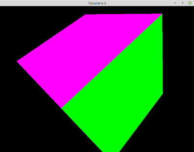

# Module Four Tutorial
## Section 4-1: Handling Keyboard Input

The code for this section ([tut_04_01.cpp](./tut_04_01.cpp)) demonstrates how to do the following:

* Handle keyboard input using GLFW.

This tutorial is a simplified application that initializes GLFW, GLEW, and OpenGL; creates a window and an OpenGL context; and handles keyboard input.

Up until this tutorial, the function `UProcessInput` was only used to handle the `ESC` key (to terminate the application). In this tutorial we update it to also handle the keys `W,` `A`, `S`, and `D`.

    void UProcessInput(GLFWwindow* window)
    {
        if (glfwGetKey(window, GLFW_KEY_ESCAPE) == GLFW_PRESS)
            glfwSetWindowShouldClose(window, true);

        bool keypress = false;

        if (glfwGetKey(window, GLFW_KEY_W) == GLFW_PRESS)
        {
            cout << "You pressed W! ";
            keypress = true; 
        }
        if (glfwGetKey(window, GLFW_KEY_S) == GLFW_PRESS)
        {
            cout << "You pressed S! ";
            keypress = true; 
        }
        if (glfwGetKey(window, GLFW_KEY_A) == GLFW_PRESS)
        {
            cout << "You pressed A! ";
            keypress = true; 
        }
        if (glfwGetKey(window, GLFW_KEY_D) == GLFW_PRESS)
        {
            cout << "You pressed D! ";
            keypress = true; 
        }

        if (keypress)
        {
            double x, y;
            glfwGetCursorPos(window, &x, &y);
            cout << "Cursor at position (" << x << ", " << y << ")" << endl;
        }
    }


In GLFW, we get the status of a specific key with the function `glfwGetKey`, which has only two possible outcomes: `GLFW_PRESS` and `GLFW_RELEASE`. Each one of the keys has a specific identifier: in our case, `GLFW_KEY_W`, `GLFW_KEY_S`, `GLFW_KEY_A`, and `GLFW_KEY_D`. If one of these keys is pressed, we print a message to the standard output stream stating so. Finally, if any of these keys was still pressed in the last frame, we also print the current position of the cursor using the function `glfwGetCursorPos`.

When you run the application, be sure to press a key so something occurs. Although your screen will appear black, your output should look similar to the following:

```
INFO: OpenGL Version: 4.4.0 NVIDIA 440.100
You pressed A! Cursor at position (251, 491)
You pressed A! Cursor at position (251, 491)
You pressed A! Cursor at position (251, 491)
You pressed A! Cursor at position (251, 491)
You pressed A! Cursor at position (251, 491)
You pressed A! Cursor at position (251, 491)
You pressed A! Cursor at position (251, 491)
You pressed A! Cursor at position (251, 491)
You pressed A! Cursor at position (251, 491)
You pressed A! Cursor at position (251, 491)
You pressed A! Cursor at position (251, 491)
You pressed A! Cursor at position (251, 491)
You pressed A! Cursor at position (251, 491)
You pressed A! Cursor at position (251, 491)
You pressed W! Cursor at position (251, 491)
You pressed W! Cursor at position (251, 491)
You pressed W! Cursor at position (251, 491)
You pressed W! Cursor at position (251, 491)
You pressed W! Cursor at position (251, 491)
You pressed W! Cursor at position (251, 491)
You pressed W! Cursor at position (251, 491)
You pressed W! Cursor at position (251, 491)
You pressed W! Cursor at position (251, 491)
You pressed W! Cursor at position (251, 491)
You pressed W! Cursor at position (251, 491)
You pressed W! Cursor at position (251, 491)
You pressed W! Cursor at position (251, 491)
You pressed D! Cursor at position (251, 491)
```

#### Exercise

Check out [GLFW's Documentation](https://www.glfw.org/docs/latest/group__keys.html) and augment `UProcessInput` to handle multiple keys at the same time. For example, print a message to the screen if `Shift` and `A` are pressed simultaneously.


## Section 4-2: Handling Mouse Input

The code for this section ([tut_04_02.cpp](./tut_04_02.cpp)) demonstrates how to do the following:

* Handle mouse input using GLFW.

There are three different tasks that we need to implement to cover all mouse input: 1) retrieve the position of the cursor, 2) handle scrolling events, and 3) handle mouse clicks.

In order to do this, we are going to implement three callback functions:

```
void UMousePositionCallback(GLFWwindow* window, double xpos, double ypos);
void UMouseScrollCallback(GLFWwindow* window, double xoffset, double yoffset);
void UMouseButtonCallback(GLFWwindow* window, int button, int action, int mods);
```

We need to register these callback functions so GLFW knows what code to execute for each of the three different types of mouse events. In the `UInitialize` function, we register these three callbacks:

```
glfwSetCursorPosCallback(*window, UMousePositionCallback);
glfwSetScrollCallback(*window, UMouseScrollCallback);
glfwSetMouseButtonCallback(*window, UMouseButtonCallback);
```

### Mouse Position Callback

The mouse position callback is straightforward. Whenever the mouse moves, the callback gets called and recieves the X and Y screen coordinates of the cursor as input.

```
// glfw: Whenever the mouse moves, this callback is called.
// -------------------------------------------------------
void UMousePositionCallback(GLFWwindow* window, double xpos, double ypos)
{
    cout << "Mouse at (" << xpos << ", " << ypos << ")" << endl;
}
```

### Mouse Scrolling Callback

The mouse scroll callback is pretty similar. For a regular mouse, the `xoffset` input will always be zero, since the wheel is one-dimensional (either goes up or down). A value of `yoffset` of `1.0` means rolling one way, and `-1.0` the opposite. Test to determine which one is which. Note that the reason this callback gets both an `xoffset` and `yoffset` is to support more advanced input devices. 

```
// glfw: Whenever the mouse scroll wheel scrolls, this callback is called.
// ----------------------------------------------------------------------
void UMouseScrollCallback(GLFWwindow* window, double xoffset, double yoffset)
{
    cout << "Mouse wheel (" << xoffset << ", " << yoffset << ")" << endl;
}
```

### Mouse Button Callback

Finally we examine the button callback, which is very similar to the keyboard handling callback from tutorial 4.1. This function receives several input integer values. The two we care about are button and action:

* __Button__: This holds the ID of the button triggering the event. For a regular three-button mouse, we might receive `GLFW_MOUSE_BUTTON_LEFT`, `GLFW_MOUSE_BUTTON_MIDDLE`, or `GLFW_MOUSE_BUTTON_RIGHT`.
* __Action__: As with the keyboard events, this variable can only hold two values, `GLFW_PRESS` or `GLFW_RELEASE`.

```
// glfw: Handle mouse button events.
// --------------------------------
void UMouseButtonCallback(GLFWwindow* window, int button, int action, int mods)
{
    switch (button)
    {
        case GLFW_MOUSE_BUTTON_LEFT:
        {
            if (action == GLFW_PRESS)
                cout << "Left mouse button pressed" << endl;
            else
                cout << "Left mouse button released" << endl;
        }
        break;

        case GLFW_MOUSE_BUTTON_MIDDLE:
        {
            if (action == GLFW_PRESS)
                cout << "Middle mouse button pressed" << endl;
            else
                cout << "Middle mouse button released" << endl;
        }
        break;

        case GLFW_MOUSE_BUTTON_RIGHT:
        {
            if (action == GLFW_PRESS)
                cout << "Right mouse button pressed" << endl;
            else
                cout << "Right mouse button released" << endl;
        }
        break;

        default:
            cout << "Unhandled mouse button event" << endl;
            break;
    }
}
```

When you run this application, your screen will appear black but your output should look similar to the following:

```
Mouse at (366, 376)
Mouse at (363, 376)
Mouse at (362, 376)
Mouse at (359, 376)
Mouse at (358, 376)
Mouse at (357, 376)
Mouse at (356, 377)
Mouse at (354, 377)
Mouse at (353, 377)
Mouse wheel (0, 1)
Mouse wheel (0, 1)
Mouse wheel (0, 1)
Mouse wheel (0, 1)
Mouse wheel (0, -1)
Mouse wheel (0, -1)
Mouse wheel (0, -1)
Mouse wheel (0, -1)
Mouse wheel (0, -1)
Mouse wheel (0, -1)
Mouse wheel (0, 1)
Mouse wheel (0, 1)
Mouse wheel (0, 1)
Mouse wheel (0, 1)
Mouse wheel (0, -1)
Mouse wheel (0, -1)
Left mouse button pressed
Left mouse button released
Middle mouse button pressed
Middle mouse button released
Right mouse button pressed
Right mouse button released
```

#### Exercise

Modify the mouse position and mouse button callbacks so the position of the cursor is only printed when the left button is down.


## Section 4-3: Controlling the Camera With the Keyboard

The code for this section ([tut_04_03.cpp](./tut_04_03.cpp)) demonstrates how to do the following:

* Draw a mesh with one color per face.
* Update the position of the camera with the keyboard and GLM's `lookAt` function.

### Per-Face (not Per-Vertex) Colors

This tutorial contains quite a bit more code than 4.2, and it is actually closer to tutorial 3.4 (which introduced the perspective projection). Unlike tutorial 3.4, we want to draw a cube that has one color per face instead of per vertex. This prevents us from drawing using indices (and `glDrawElements`) since each vertex will belong to three different faces and each face will have a different color. This means we cannot share a vertex among different faces, so we will have to add three vertices for every actual location. If a cube has eight vertices, then we will end up with 24 vertices in total. Please take a look at `UCreateMesh`. Also, we will now go back to rendering using `glDrawArrays`.

### Camera Control

Since we are going to control the position of the camera with the keyboard (we will deal with the orientation in the next tutorial), we first need to declare a couple of variables to store the camera's location and orientation. At the top of our file, inside of the unnamed namespace, we add the following declarations:

```
glm::vec3 gCameraPos   = glm::vec3(0.0f, 0.0f,  3.0f);
glm::vec3 gCameraFront = glm::vec3(0.0f, 0.0f, -1.0f);
glm::vec3 gCameraUp    = glm::vec3(0.0f, 1.0f,  0.0f);
```

Any 3D object is defined by its location and three orthogonal axes. As you can see in the previous declaration, we only define the _front_ (forward) and _up_ directions, but remember that computing the third one (right vector) is straightforward and only requires taking the cross product of the front and up vectors.

In the `UProcessInput` function, we tie the keystrokes `W` and `S` to the actions of moving the camera forward and backward, and `A` and `D` to moving left and right:

```
void UProcessInput(GLFWwindow* window)
{
    static const float cameraSpeed = 2.5f;

    if (glfwGetKey(window, GLFW_KEY_ESCAPE) == GLFW_PRESS)
        glfwSetWindowShouldClose(window, true);

    float cameraOffset = cameraSpeed * gDeltaTime;

    if (glfwGetKey(window, GLFW_KEY_W) == GLFW_PRESS)
        gCameraPos += cameraOffset * gCameraFront;
    if (glfwGetKey(window, GLFW_KEY_S) == GLFW_PRESS)
        gCameraPos -= cameraOffset * gCameraFront;
    if (glfwGetKey(window, GLFW_KEY_A) == GLFW_PRESS)
        gCameraPos -= glm::normalize(glm::cross(gCameraFront, gCameraUp)) * cameraOffset;
    if (glfwGetKey(window, GLFW_KEY_D) == GLFW_PRESS)
        gCameraPos += glm::normalize(glm::cross(gCameraFront, gCameraUp)) * cameraOffset;
}
```

The distance that the camera travels is dictated by the speed (`cameraSpeed`) and the time elapsed since the last frame. For this purpose, we declare inside of the unnamed namespace the following two variables:

```
float gDeltaTime = 0.0f; // Time between current frame and last frame
float gLastFrame = 0.0f;
```

The time elapsed is computed inside the _render loop_, in the `main` function:

```
float currentFrame = glfwGetTime();
gDeltaTime = currentFrame - gLastFrame;
gLastFrame = currentFrame;
```

With the camera position (`gCameraPos`) always up to date thanks to function `UProcessInput`, in `URender`, we use GLM's `lookAt` function to create the view matrix. This function requires three inputs: the camera's position, the target (what the camera is looking at), and the up vector of the camera.

```
glm::mat4 view = glm::lookAt(gCameraPos, gCameraPos + gCameraFront, gCameraUp);
```

Finally, we will transfer its value to the vertex shader inside a uniform variable.

When you first start the application, you should see the image on the left. If you move the camera back (by pressing `S`) and then to the left (by pressing `A`), you should see something similar to the image on the right.


 |  

#### Exercise

Modify the `UProcessInput` function to also handle the keys `Q` and `E`. For example, move the camera straight up when pressing `E` and straight down when pressing `Q`.


## Section 4-4: Controlling the Camera With the Keyboard and Mouse

The code for this section ([tut_04_04.cpp](./tut_04_04.cpp)) demonstrates how to do the following:

* Control the orientation of the camera with the mouse.
* Adjust the field of view of the perpective projection with the mouse wheel.

So far, we know how to move the camera forward, backward, left, and right using the WASD keys, but we need more freedom than that. In order to be able to move in all directions, we are going to recruit the help of the mouse. Thankfully, LearnOpengl has a `Camera` class ([camera.h](../includes/learnOpengl/camera.h)) that does exactly what we need.

The `Camera` class has member variables that keep track of the state of the camera (such as location and orientation), as well as some configuration values (camera speed, mouse sensitivity, and so on). In order to use this class, we will need to initialize an instance of `Camera` and then call four of its methods: `ProcessKeyboard`, `ProcessMouseMovement`, `ProcessMouseScroll`, and `GetViewMatrix`.

### ProcessKeyboard

The `ProcessKeyboard` member function does basically what our `UProcessInput` function was doing in previous tutorials. It updates the position of the camera when the keys `W`, `A`, `S`, or `D` are pressed.

### ProcessMouseScroll

`ProcessMouseScroll` does not actually change the position or orientation of the camera. Instead it updates its `Zoom` value, which will be used to set the field of view of the perspective projection. Notice that the zoom value is clamped to the range `[1.0, 45.0]` degrees.

```
void Camera::ProcessMouseScroll(float yoffset)
{
    Zoom -= (float)yoffset;
    if (Zoom < 1.0f)
        Zoom = 1.0f;
    if (Zoom > 45.0f)
        Zoom = 45.0f; 
}
```

We call this function from `UMouseScrollCallback`.

### ProcessMouseMovement

This function handles the change in orientation. It takes as input the offset in X and Y of the cursor, or the difference in position between this frame and the last frame. It uses this offset to update the yaw and pitch of the camera. Finally, it calls the `updateCameraVectors` to recompute the three axes of the camera (front, right, and up).

```
void Camera::ProcessMouseMovement(float xoffset, float yoffset, GLboolean constrainPitch = true)
{
    xoffset *= MouseSensitivity;
    yoffset *= MouseSensitivity;

    Yaw   += xoffset;
    Pitch += yoffset;

    // Make sure that when pitch is out of bounds, the screen doesn't get flipped.
    if (constrainPitch)
    {
        if (Pitch > 89.0f)
            Pitch = 89.0f;
        if (Pitch < -89.0f)
            Pitch = -89.0f;
    }

    // Update Front, Right, and Up Vectors using the updated Euler angles.
    updateCameraVectors();
}
```

We call this function from our own `UMousePositionCallback`.

```
void UMousePositionCallback(GLFWwindow* window, double xpos, double ypos)
{
    if (gFirstMouse)
    {
        gLastX = xpos;
        gLastY = ypos;
        gFirstMouse = false;
    }

    float xoffset = xpos - gLastX;
    float yoffset = gLastY - ypos; // Reversed since y-coordinates go from bottom to top

    gLastX = xpos;
    gLastY = ypos;

    gCamera.ProcessMouseMovement(xoffset, yoffset);
}
```

### Building the Projection and View Matrices

In function `URender`, we query the instance of `Camera` to retrieve the view and perspective projection matrices.

```
    glm::mat4 view = gCamera.GetViewMatrix();

    glm::mat4 projection = glm::perspective(glm::radians(gCamera.Zoom), (GLfloat)WINDOW_WIDTH / (GLfloat)WINDOW_HEIGHT, 0.1f, 100.0f);
```

If you run this application, you should be able to move the position of the camera with the WASD keys, zoom in and out with the mouse wheel, and change the orientation of the camera by moving the mouse.


## Section 4-5: Drawing Multiple Cubes

The code for this section ([tut_04_05.cpp](./tut_04_05.cpp)) demonstrates how to do the following:

* Draw multiple cubes using a single mesh object.

If you start the application and move the camera back (by pressing S), you should see multiple cubes. 

![Multiple multicolored cubes against a black background, generated using OpenGL. About a half dozen rows of cubes move away from the point of view on either side of the image. Each row continues far into the distance until the cubes are too small to be visible. Every cube is identical though shown from a slightly different perspective. The closest side, which is parallel to the field of view, is dark blue. On the right, the upper side is pink and the lower side is green. On the left, the upper side is red and the lower side is light blue. The sixth side (the one directly opposite the dark blue side) is always facing away from the camera so we cannot determine what color it is from the image.](./multiple_cubes.png)

All the changes from this tutorial are confined to function `URender`. We first initialize some variables that will control how many rows, columns, and stacks of cubes we will draw (`nrows`, `ncols`, and `nlevels`). We will also configure how far apart we will be spacing them (`xsize`, `ysize`, and `zsize`).

```
const int nrows = 10;
const int ncols = 10;
const int nlevels = 10;

const float xsize = 10.0f;
const float ysize = 10.0f;
const float zsize = 10.0f;
```

The view and projection matrices are the same for all cubes, so that code remains unchanged. The model matrix must change if we are going to draw cubes at different positions (and potentially different orientations and scales), so we move that code inside a triple-nested FOR loop.

```
// 1. Scales the object by 2
glm::mat4 scale = glm::scale(glm::vec3(2.0f, 2.0f, 2.0f));
// 2. Rotates shape by 15 degrees in the x axis
glm::mat4 rotation = glm::rotate(45.0f, glm::vec3(1.0, 1.0f, 1.0f));

for (int i = 0; i < nrows; ++i)
{
    for (int j = 0; j < ncols; ++j)
    {
        for (int k = 0; k < nlevels; ++k)
        {
            glm::vec3 location = glm::vec3(i * xsize, j * ysize, k * zsize);
            // 3. Places object at the origin
            glm::mat4 translation = glm::translate(location);
            // Model matrix: Transformations are applied in right-to-left order.
            glm::mat4 model = translation * rotation * scale;
            glUniformMatrix4fv(modelLoc, 1, GL_FALSE, glm::value_ptr(model));
        
            // Draws the triangles
            glDrawArrays(GL_TRIANGLES, 0, gMesh.nVertices);
        }
    }
}
```

### Instancing

The method demonstrated in this tutorial is not the most efficient way to draw the very same mesh multiple times. If your computer drops to a very low frame rate, try reducing the number of cubes by lowering the values of `nrows`, `ncols`, or `nlevels`. The problem is that inside the triple-nested FOR loop, we are calling the functions `glUniformMatrix4fv` and `glDrawArrays` for every iteration, and calling these functions is expensive. The more efficient way to accomplish the same output is by using _instancing_, where we pass the data to the GPU once but tell OpenGL how to draw it multiple times. In this case, we would pass the model matrices (one for each cube) inside a _uniform block_ and we would render by calling `glDrawArraysInstanced`.

#### Exercise

Play with the number of cubes you render by changing the value of `nrows`, `ncols`, or `nlevels` in the `URender` function. Print the value of `gDeltaTime` to standard output toward the end of the `URender` function. Does the value increase or decrease? What does that change imply? Note that as you increase the number of cubes, the responsiveness of the program may degrade. Pressing Esc may not halt the program right away, but it will eventually close.

_Congratulations, you have now reached the end of the tutorial for Module Four!_
