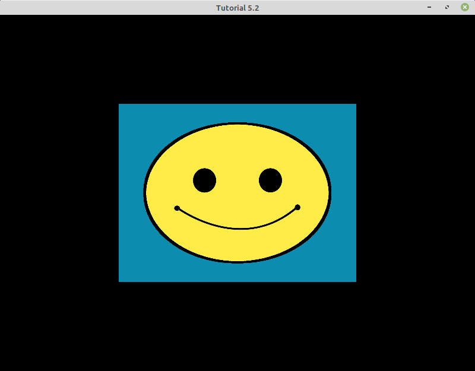
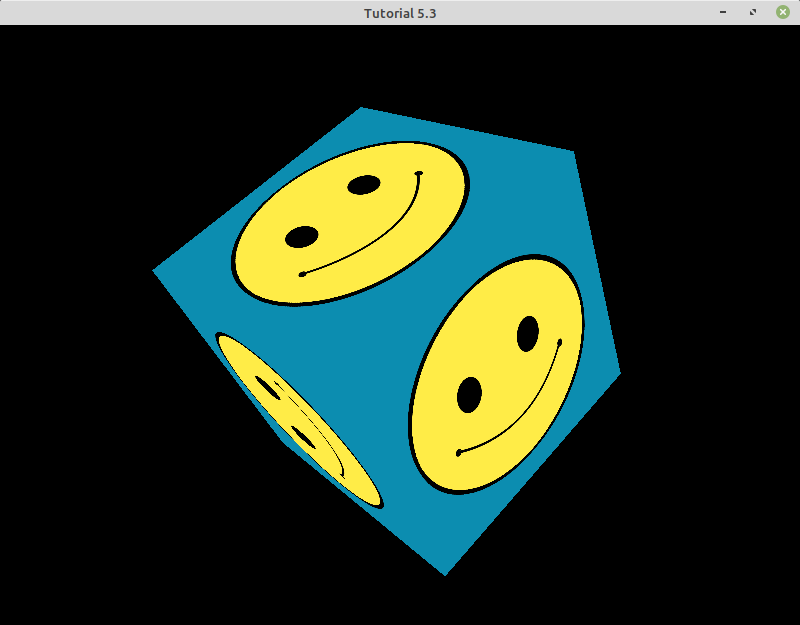
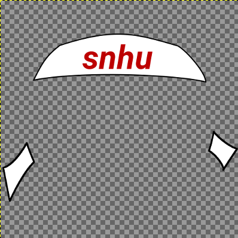
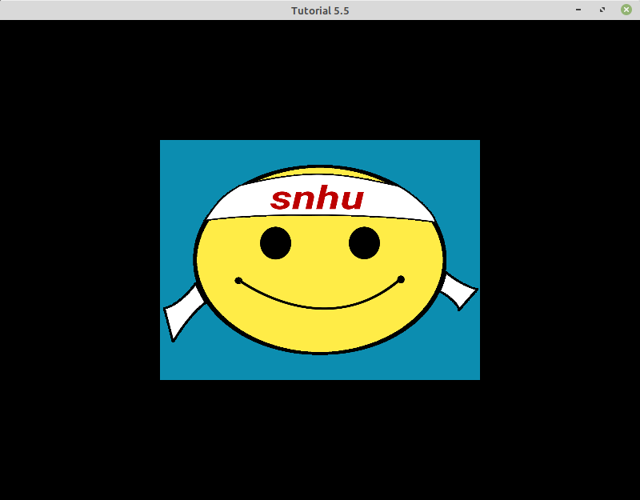

# Module Five Tutorial
## Section 5-1: Loading an Image

All the tutorials in this module require that we load an image. For this purpose, we are going to use the STB library. This library is a single-file library that does not require linking against any precompiled static or dynamic libraries: We just need to include the `stb_image.h` header file, as in the following:

```
#define STB_IMAGE_IMPLEMENTATION
#include <stb_image.h>      // Image loading Utility functions
```

The only function that we are going to use from this library is `stbi_load`, which returns the width, height, and number of channels of the loaded image. The actual pixel data is returned as a pointer to a dynamically allocated array (`image` in the following example).

```
int width, height, channels;
unsigned char *image = stbi_load(filename, &width, &height, &channels, 0);
if (image)
{
    flipImageVertically(image, width, height, channels);

    // Do something with the image
    ...

    // Release the image
    stbi_image_free(image);
}

```

Regarding the previous code snippet, there are a few notes to keep in mind:

* If the image fails to load, the pointer `image` will be null.
* We are going to pass this image as as texture to OpenGL, therefore we will want to flip the image vertically. In OpenGL the Y points straight up, while most image formats have the Y axis point down. For this purpose, we call the function `flipImageVertically`.
* Do not forget to release the memory dynamically allocated by `stbi_load`. This is done by calling `stbi_image_free`.


That comprises the basics of image loading (flipping and unloading).


## Section 5-2: Loading and Applying a Texture

The code for this section ([tut_05_02.cpp](./tut_05_02.cpp)) demonstrates how to do the following:

* Assign texture coordinates to a mesh.
* Load and bind a texture.
* Access a texture in the fragment shader.

### Assigning Texture Coordinates to a Mesh

For this example, we are going to apply texture to a cube. Texture coordinates are just floating-point values that map an image to the range `[0.0, 1.0]` both in X and Y. However, as we will see later, texture coordinates can take values outside of the `[0.0, 1.0]` range.

Texture coordinates are assigned to the vertices of the mesh and, as we saw with vertex colors, the vertex shader will output them so OpenGL performs perspective-correct interpolation. It will be the interpolated values that will be the input to the fragment shader. In `UCreateMesh` we specify the texture coordinates as another attribute.

```
GLfloat verts[]=
{
    // Positions          // Color                  // Texture Coordinates
     0.5f,  0.5f, 0.0f,   1.0f, 0.0f, 0.0f, 1.0f,   1.0f, 1.0f, // Top-Right Vertex 0
     0.5f, -0.5f, 0.0f,   0.0f, 1.0f, 0.0f, 1.0f,   1.0f, 0.0f, // Bottom-Right Vertex 1
    -0.5f, -0.5f, 0.0f,   0.0f, 0.0f, 1.0f, 1.0f,   0.0f, 0.0f, // Bottom-Left Vertex 2
    -0.5f,  0.5f, 0.0f,   1.0f, 0.0f, 1.0f, 1.0f,   0.0f, 1.0f  // Top-Left Vertex 3
};

const GLuint floatsPerVertex = 3;
const GLuint floatsPerColor = 4;
const GLuint floatsPerUV = 2;
```

Next, we update the stride.

```
GLint stride =  sizeof(float) * (floatsPerVertex + floatsPerColor + floatsPerUV);
```

Then we specify and enable vertex attribute `2`. Remember that 0 is for the vertex positions and 1 is for the vertex colors.

```
glVertexAttribPointer(2, floatsPerUV, GL_FLOAT, GL_FALSE, stride, (void*)(sizeof(float) * (floatsPerVertex + floatsPerColor)));
glEnableVertexAttribArray(2);
```

### Loading and Binding a Texture

In order to load and bind a texture, we need to introduce the new function `UCreateTexture`.

```
bool UCreateTexture(const char* filename, GLuint &textureId)
{
    int width, height, channels;
    unsigned char *image = stbi_load(filename, &width, &height, &channels, 0);
    if (image)
    {
        flipImageVertically(image, width, height, channels);

        glGenTextures(1, &textureId);
        glBindTexture(GL_TEXTURE_2D, textureId);

        // Set the texture wrapping parameters.
        glTexParameteri(GL_TEXTURE_2D, GL_TEXTURE_WRAP_S, GL_REPEAT);
        glTexParameteri(GL_TEXTURE_2D, GL_TEXTURE_WRAP_T, GL_REPEAT);
        // Set texture filtering parameters.
        glTexParameteri(GL_TEXTURE_2D, GL_TEXTURE_MIN_FILTER, GL_LINEAR);
        glTexParameteri(GL_TEXTURE_2D, GL_TEXTURE_MAG_FILTER, GL_LINEAR);

        if (channels == 3)
            glTexImage2D(GL_TEXTURE_2D, 0, GL_RGB8, width, height, 0, GL_RGB, GL_UNSIGNED_BYTE, image);
        else if (channels == 4)
            glTexImage2D(GL_TEXTURE_2D, 0, GL_RGBA8, width, height, 0, GL_RGBA, GL_UNSIGNED_BYTE, image);
        else
        {
            cout << "Not implemented to handle image with " << channels << " channels" << endl;
            return false;
        }

        glGenerateMipmap(GL_TEXTURE_2D);

        stbi_image_free(image);
        glBindTexture(GL_TEXTURE_2D, 0); // Unbind the texture.

        return true;
    }

    // Error loading the image
    return false;
}
```

This function only handles images with three and four channels (RGB and RGBA). The wrapping parameters will be explained later, but filtering parameters are configured to perform linear interpolation. When we read the texture we will likely not have integer texture coordinates, so what texel (pixel) do we access for texture coordinates `(5.2, 12.8)`? GL_LINEAR tells OpenGL to do a bilinear interpolation with the four closest neighboring texels: `(5, 12)`, `(5, 13)`, `(6, 12)`, and `(6, 13)`.

```
glTexParameteri(GL_TEXTURE_2D, GL_TEXTURE_MIN_FILTER, GL_LINEAR);
glTexParameteri(GL_TEXTURE_2D, GL_TEXTURE_MAG_FILTER, GL_LINEAR);
```

The function `glTexImage2D` transfers the image to the GPU. `glGenerateMipmap` generates mipmap images (though note that understanding this in depth is outside the scope of our work here).

Whenever we are ready to render a mesh with a shader that requires textures, these textures need to be activated. This process is similar to how we activate any other uniform type, but instead of passing the values of a vector or a matrix we instead pass the index of an _active texture unit_. Think of active texture units as an array of textures that are currently available for drawing. In `URender` we add the following:

```
glActiveTexture(GL_TEXTURE0);
glBindTexture(GL_TEXTURE_2D, gTextureId);
```

The function `UCreateTexture` is called from the `main` function, before entering the render loop.

```
const char * texFilename = "../../resources/textures/smiley.png";
if (!UCreateTexture(texFilename, gTextureId))
{
    cout << "Failed to load texture " << texFilename << endl;
    return EXIT_FAILURE;
}
// Tell OpenGL for each sampler which texture unit it belongs to (only has to be done once).
glUseProgram(gProgramId);
// We set the texture as texture unit 0.
glUniform1i(glGetUniformLocation(gProgramId, "uTexture"), 0);
```

If we call `glActiveTexture` with parameter `GL_TEXTURE0`, then we pass parameter `0` to `glUniform1i`. If we had called `glActiveTexture` with parameter `GL_TEXTURE7`, then we would have had to pass parameter `7`to `glUniform1i`. The number of active texture units is implementation dependant and can be queried from OpenGL.

### Accessing a Texture in the Fragment Shader

Each call to the vertex shader receives and outputs the vertex coordinates for a vertex, so OpenGL does a perspective-correct interpolation, producing the vertex coordinates to be used in the fragment shader.

```
layout (location = 0) in vec3 position;
layout (location = 2) in vec2 textureCoordinate;

out vec2 vertexTextureCoordinate;

void main()
{
    gl_Position = vec4(position.x, position.y, position.z, 1.0);
    vertexTextureCoordinate = textureCoordinate;
}
```

Note how we are not declaring an attribute at location `1` (the vertex color). That attribute is still in the VBO, but we just ignore it in this shader since we do not need the vertex color. The fragment shader declares the `Sampler2D` uniform variable that, at active texture unit `0`, holds our texture.

```
in vec2 vertexTextureCoordinate;

out vec4 fragmentColor;

uniform sampler2D uTexture;

void main()
{
    fragmentColor = texture(uTexture, vertexTextureCoordinate); // Sends texture to the GPU for rendering
}
```

Finally, the GLSL function `texture` takes as input a `Sampler2D` and a `vec2` with the texture coordinates, and returns the bilinearly interpolated texel value at those coordinates.

The following image shows the final result:




#### Exercise

* Try to comment out the call to `flipImageVertically` (in `UCreateTexture`) and see how the image flips its orientation.
* What happens when you load a grayscale image with just one channel? What changes are needed to handle this type of image?

## Section 5-3: Texturing to a Cube

The code for this section ([tut_05_03.cpp](./tut_05_03.cpp)) demonstrates how to do the following:

* Apply texture to a cube.

The code for this tutorial is almost identical to the previous one, demonstrating how the shader code does not need to change to apply a texture to a different (in this case, more complex) mesh. The most relevant changes are in function `UCreateMesh`, which now has the data (vertex locations and vertex coordinates) for a cube. Note that for this example, we have dropped the vertex colors, yet we keep the vertex locations as attribute `0` and the vertex coordinates as attribute `2`. There is no requirement preventing us from skipping an attribute index.

```
GLfloat verts[] = {
     //Positions          //Texture Coordinates
    -0.5f, -0.5f, -0.5f,  0.0f, 0.0f,
     0.5f, -0.5f, -0.5f,  1.0f, 0.0f,
     0.5f,  0.5f, -0.5f,  1.0f, 1.0f,
     0.5f,  0.5f, -0.5f,  1.0f, 1.0f,
    -0.5f,  0.5f, -0.5f,  0.0f, 1.0f,
    -0.5f, -0.5f, -0.5f,  0.0f, 0.0f,

    -0.5f, -0.5f,  0.5f,  0.0f, 0.0f,
     0.5f, -0.5f,  0.5f,  1.0f, 0.0f,
     0.5f,  0.5f,  0.5f,  1.0f, 1.0f,
     0.5f,  0.5f,  0.5f,  1.0f, 1.0f,
    -0.5f,  0.5f,  0.5f,  0.0f, 1.0f,
    -0.5f, -0.5f,  0.5f,  0.0f, 0.0f,

    -0.5f,  0.5f,  0.5f,  1.0f, 0.0f,
    -0.5f,  0.5f, -0.5f,  1.0f, 1.0f,
    -0.5f, -0.5f, -0.5f,  0.0f, 1.0f,
    -0.5f, -0.5f, -0.5f,  0.0f, 1.0f,
    -0.5f, -0.5f,  0.5f,  0.0f, 0.0f,
    -0.5f,  0.5f,  0.5f,  1.0f, 0.0f,

     0.5f,  0.5f,  0.5f,  1.0f, 0.0f,
     0.5f,  0.5f, -0.5f,  1.0f, 1.0f,
     0.5f, -0.5f, -0.5f,  0.0f, 1.0f,
     0.5f, -0.5f, -0.5f,  0.0f, 1.0f,
     0.5f, -0.5f,  0.5f,  0.0f, 0.0f,
     0.5f,  0.5f,  0.5f,  1.0f, 0.0f,

    -0.5f, -0.5f, -0.5f,  0.0f, 1.0f,
     0.5f, -0.5f, -0.5f,  1.0f, 1.0f,
     0.5f, -0.5f,  0.5f,  1.0f, 0.0f,
     0.5f, -0.5f,  0.5f,  1.0f, 0.0f,
    -0.5f, -0.5f,  0.5f,  0.0f, 0.0f,
    -0.5f, -0.5f, -0.5f,  0.0f, 1.0f,

    -0.5f,  0.5f, -0.5f,  0.0f, 1.0f,
     0.5f,  0.5f, -0.5f,  1.0f, 1.0f,
     0.5f,  0.5f,  0.5f,  1.0f, 0.0f,
     0.5f,  0.5f,  0.5f,  1.0f, 0.0f,
    -0.5f,  0.5f,  0.5f,  0.0f, 0.0f,
    -0.5f,  0.5f, -0.5f,  0.0f, 1.0f
};

const GLuint floatsPerVertex = 3;
const GLuint floatsPerUV = 2;

mesh.nVertices = sizeof(verts) / (sizeof(verts[0]) * (floatsPerVertex + floatsPerUV));

glGenVertexArrays(1, &mesh.vao); // We can also generate multiple VAOs or buffers at the same time.
glBindVertexArray(mesh.vao);

// Create VBO.
glGenBuffers(1, &mesh.vbo);
glBindBuffer(GL_ARRAY_BUFFER, mesh.vbo); // Activates the buffer
glBufferData(GL_ARRAY_BUFFER, sizeof(verts), verts, GL_STATIC_DRAW); // Sends vertex or coordinate data to the GPU

// Strides between vertex coordinates
GLint stride =  sizeof(float) * (floatsPerVertex + floatsPerUV);

// Create Vertex Attribute Pointers.
glVertexAttribPointer(0, floatsPerVertex, GL_FLOAT, GL_FALSE, stride, 0);
glEnableVertexAttribArray(0);

glVertexAttribPointer(2, floatsPerUV, GL_FLOAT, GL_FALSE, stride, (void*)(sizeof(float) * floatsPerVertex));
glEnableVertexAttribArray(2);
```

The following image shows the final result:




## Section 5-4: Tiling and Texture Wrapping

The code for this section ([tut_05_04.cpp](./tut_05_04.cpp)) demonstrates how to do the following:

* Tile a texture.
* Configure the wrapping parameters of a texture.

### Texture Tiling

Imagine that you have a texture of a brick wall that looks perfect when applied to a plane of size 2x2 meters. If we want to apply the same texture to a wall that extends for 100 meters, the texture will appear very stretched and not produce the desired image. To solve this problem, we can _tile_ the texture. Doing this in OpenGL is very simple. We just need to define two parameters:

* A scale factor for the horizontal axis of the texture
* A scale factor for the vertical axis of the texture

We are going to encapsulate these two values inside a `vec2`, which is declared in a global variable in our unnamed namespace.

```
static glm::vec2 gUVScale(5.0f, 5.0f);
```

We pass this vector as a uniform. Therefore in `URender` we add the following two lines:

```
GLint UVScaleLoc = glGetUniformLocation(gProgramId, "uvScale");
glUniform2fv(UVScaleLoc, 1, glm::value_ptr(gUVScale));
```

In the fragment shader, we multiply the texture coordinates by the following two scale factors:

```
in vec2 vertexTextureCoordinate;

out vec4 fragmentColor;

uniform sampler2D uTexture;
uniform vec2 uvScale;

void main()
{
    fragmentColor = texture(uTexture, vertexTextureCoordinate * uvScale);
}
```

But how does GLSL's `texture` function deal with texture coordinates that fall outside the range `[0.0, 1.0]`? For that, we need to tell OpenGL how to _wrap_ the texture coordinates.

### Texture Wrapping

OpenGL supports four different wrapping modes:

* `GL_REPEAT`: The default behavior which repeats the texture image. This means that the texel value is the same for texture coordinates `(0.2, 0.7)`, `(1.2, 0.7)`, and `(33.2, 1000.7)`.
* `GL_MIRRORED_REPEAT`: The same as `GL_REPEAT` but mirroring the image with each repeat. Texture coordinates that truncate to an odd integer are mirrored values of the ones that truncate to an even integer. For example, texture coordinate `0.7` is the same as `1.3` (they're both `0.3` from `1.0`). 
* `GL_CLAMP_TO_EDGE`: This clamps the vertex coordinates to the range `[0.0, 1.0]`.
* `GL_CLAMP_TO_BORDER`: This clamps the vertex coordinates to the range `[0.0, 1.0]`. Coordinates outside the range are given a pre-defined border color.

In order to facilitate visualizing the differences between these four wrapping modes, the `UProcessInput` function has been updated to enable switching between these four modes using keys `1`, `2`, `3`, and `4`:

* `1` is used for `GL_REPEAT`
* `2` is used for `GL_MIRRORED_REPEAT`
* `3` is used for `GL_CLAMP_TO_EDGE`
* `4` is used for `GL_CLAMP_TO_BORDER`

Also in the same function, the keys `[` and `]` decrease and increase the texture tiling parameters, respectively.

The following images show the final results for a tiling value of `(2.0, 2.0)`.


 | 
 | 

Top-left `GL_REPEAT`; top-right `GL_MIRRORED_REPEAT`; bottom-left `GL_CLAMP_TO_EDGE`; bottom-right `GL_CLAMP_TO_BORDER` (with a border color of `(1.0, 0.0, 1.0, 1.0)`).


#### Exercise

Switch between the different wrapping modes (using keys `1`, `2`, `3`, and `4`) at the same time that you examine the results for different texture tiling values (controled with keys `[` and `]`). Investigate what happens when the scaling values increase and when the scaling values are negative.


## Section 5-5: Combining Multiple Textures

The code for this section ([tut_05_05.cpp](./tut_05_05.cpp)) demonstrates how to do the following:

* Combine more than one texture in the fragment shader.

The two textures that we will be combining are a smiley face and a bandana.

 | 

Note that the gray checked pattern represents the transparent areas of the image.

Since we are going to use two different textures, we declare two _texture IDs_ along with a boolean to turn the second texture on and off.

```
GLuint gTextureIdHappy;
GLuint gTextureIdHat;
bool gIsHatOn = true;
```

We load the two textures in `main`.

```
const char * texFilename = "../../resources/textures/smiley.png";
if (!UCreateTexture(texFilename, gTextureIdHappy))
{
    cout << "Failed to load texture " << texFilename << endl;
    return EXIT_FAILURE;
}
texFilename = "../../resources/textures/bandana.png";
if (!UCreateTexture(texFilename, gTextureIdHat))
{
    cout << "Failed to load texture " << texFilename << endl;
    return EXIT_FAILURE;
}
// Tell OpenGL for each sampler which texture unit it belongs to (only has to be done once).
glUseProgram(gProgramId);
// We set the texture as texture unit 0.
glUniform1i(glGetUniformLocation(gProgramId, "uTextureBase"), 0);
// We set the texture as texture unit 1.
glUniform1i(glGetUniformLocation(gProgramId, "uTextureExtra"), 1);
```

Also, we release this memory before exiting the application.

```
UDestroyTexture(gTextureIdHappy);
UDestroyTexture(gTextureIdHat);
```

Note how we assign the base texture to texture unit 0 and the extra texture (the bandana) to texture unit 1. In the render function, we activate active texture units 0 and 1 before rendering.

```
glActiveTexture(GL_TEXTURE0);
glBindTexture(GL_TEXTURE_2D, gTextureIdHappy);
glActiveTexture(GL_TEXTURE1);
glBindTexture(GL_TEXTURE_2D, gTextureIdHat);

// Draws the triangle
glDrawElements(GL_TRIANGLES, gMesh.nIndices, GL_UNSIGNED_SHORT, NULL); // Draws the triangle
```

### The Fragment Shader

The vertex shader remains unchanged but we now have two `2DSampler` uniform variables in the fragment shader, one for the smiley texture (`uTextureBase`) and the other one for the bandana (`uTextureExtra`). Remember that this second texture has a lot of transparency.

```
in vec2 vertexTextureCoordinate;

out vec4 fragmentColor;

uniform sampler2D uTextureBase;
uniform sampler2D uTextureExtra;
uniform bool multipleTextures;

void main()
{
    fragmentColor = texture(uTextureBase, vertexTextureCoordinate);
    if (multipleTextures)
    {
        vec4 extraTexture = texture(uTextureExtra, vertexTextureCoordinate);
        if (extraTexture.a != 0.0)
            fragmentColor = extraTexture;
    }
}
```

If boolean `multipleTextures` is true, then we combine both textures. This is done by checking the alpha value of the `extra` texture (in our example, the bandana). If the texel in the extra texture is not fully transparent, then we draw its value. If not, we use the one from the base texture (the smiley emoji).

In order to demonstrate the implementation, the `UProcessInput` has been modified to enable the two textures by pressing `H`, and disabling the second texture by pressing `J`.

The following image shows the final result when `multipleTextures` is `true`:




#### Exercise

Instead of drawing the bandana over the emoji (where the bandana currently resides), multiply, add, or substract the values of these two textures in all areas of the image. What do you get? Do you understand why? For additional information, you may wish to review the LearnOpenGL section on [Blending](https://learnopengl.com/Advanced-OpenGL/Blending).

_Congratulations, you have now reached the end of the tutorial for Module Five!_

