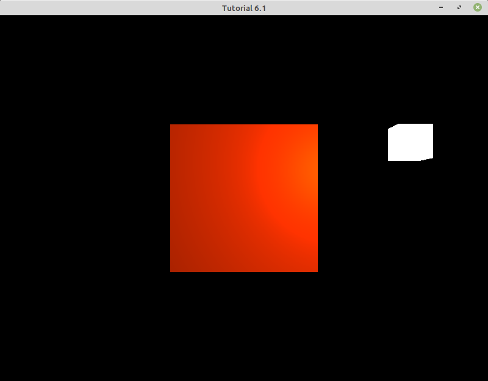
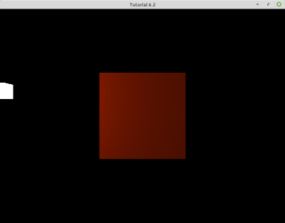
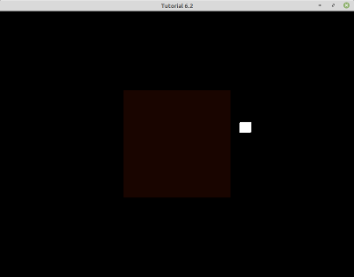
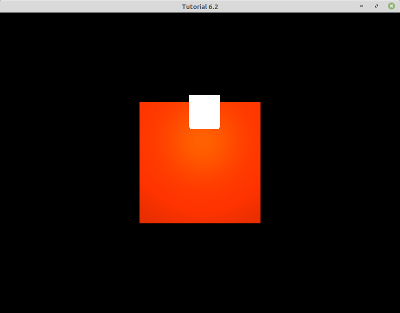
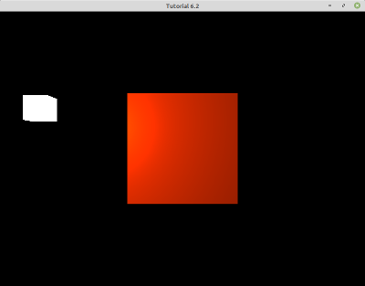
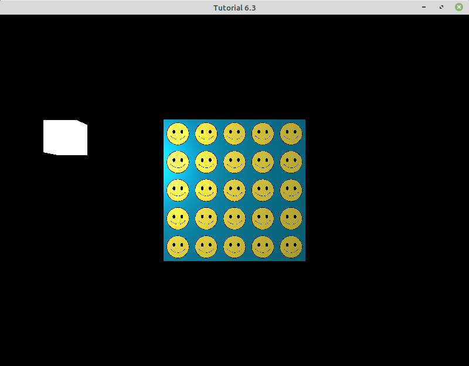

# Section 6-1: The Phong Shading Model

The code for this section ([tut_06_01.cpp](./tut_06_01.cpp)) demonstrates how to

* create a spotlight
* implement the Phong Shading Model

In order to demonstrate the Phong Shading model we are going to use a point light and a cube.

## Creating a Point Light

In computer graphics, there are several types of lights (e.g. point, directional, area and spot lights). For this example we are going to add to our scene a point light. Point lights have a location, but do not have a direction (light emits uniformly in all directions). Therefore, a point light is described by:

* its position in the world
* its color

Note: this is the simplest implementation possible of a point light, but it is common to also account for light attenuation -- the farther we are from the light, the lower its intensity.

A light's description is transferred to the GPU as uniform variables:

```
uniform vec3 lightColor;
uniform vec3 lightPos;
```

## Implementing the Phong Shading Model

The Phong Shading model approximates the interaction between light and the surface of an object by three different terms: the ambient, diffuse and specular components.

* The ambient term is a very simple approximation of _global illumination_: the color reflected by the surface of an object in the absence of direct illumination. The computation of this term is independent of the position of the light, the object or the camera.
* The diffuse term relies on the position of the light respect to the surface of the object, and it also depends on the normal of the surface at the point of shading.
* The specular term add highlights that simulate shiny materials.

Since we are going to need the normal to the surface of the object, in `UCreateMesh` we add the normal vector for each vertex as another vertex attribute. Note that in this example we are not using textures, so we do not require texture coordinates. The normal vectors are transferred to the GPU as vertex attribute `1`. Also, these normals are expressed in the object's local coordinates.

```
GLfloat verts[] = {
    //Positions          //Normals
    // --------------------------------------
    //Back Face          //Negative Z Normals
   -0.5f, -0.5f, -0.5f,  0.0f,  0.0f, -1.0f,
    0.5f, -0.5f, -0.5f,  0.0f,  0.0f, -1.0f,
    0.5f,  0.5f, -0.5f,  0.0f,  0.0f, -1.0f,
    0.5f,  0.5f, -0.5f,  0.0f,  0.0f, -1.0f,
   -0.5f,  0.5f, -0.5f,  0.0f,  0.0f, -1.0f,
   -0.5f, -0.5f, -0.5f,  0.0f,  0.0f, -1.0f,

    //Front Face         //Positive Z Normals
   -0.5f, -0.5f,  0.5f,  0.0f,  0.0f,  1.0f,
    0.5f, -0.5f,  0.5f,  0.0f,  0.0f,  1.0f,
    0.5f,  0.5f,  0.5f,  0.0f,  0.0f,  1.0f,
    0.5f,  0.5f,  0.5f,  0.0f,  0.0f,  1.0f,
   -0.5f,  0.5f,  0.5f,  0.0f,  0.0f,  1.0f,
   -0.5f, -0.5f,  0.5f,  0.0f,  0.0f,  1.0f,

    //Left Face          //Negative X Normals
   -0.5f,  0.5f,  0.5f, -1.0f,  0.0f,  0.0f,
   -0.5f,  0.5f, -0.5f, -1.0f,  0.0f,  0.0f,
   -0.5f, -0.5f, -0.5f, -1.0f,  0.0f,  0.0f,
   -0.5f, -0.5f, -0.5f, -1.0f,  0.0f,  0.0f,
   -0.5f, -0.5f,  0.5f, -1.0f,  0.0f,  0.0f,
   -0.5f,  0.5f,  0.5f, -1.0f,  0.0f,  0.0f,

    //Right Face         //Positive X Normals
    0.5f,  0.5f,  0.5f,  1.0f,  0.0f,  0.0f,
    0.5f,  0.5f, -0.5f,  1.0f,  0.0f,  0.0f,
    0.5f, -0.5f, -0.5f,  1.0f,  0.0f,  0.0f,
    0.5f, -0.5f, -0.5f,  1.0f,  0.0f,  0.0f,
    0.5f, -0.5f,  0.5f,  1.0f,  0.0f,  0.0f,
    0.5f,  0.5f,  0.5f,  1.0f,  0.0f,  0.0f,

    //Bottom Face        //Negative Y Normals
   -0.5f, -0.5f, -0.5f,  0.0f, -1.0f,  0.0f,
    0.5f, -0.5f, -0.5f,  0.0f, -1.0f,  0.0f,
    0.5f, -0.5f,  0.5f,  0.0f, -1.0f,  0.0f,
    0.5f, -0.5f,  0.5f,  0.0f, -1.0f,  0.0f,
   -0.5f, -0.5f,  0.5f,  0.0f, -1.0f,  0.0f,
   -0.5f, -0.5f, -0.5f,  0.0f, -1.0f,  0.0f,

    //Top Face           //Positive Y Normals
   -0.5f,  0.5f, -0.5f,  0.0f,  1.0f,  0.0f,
    0.5f,  0.5f, -0.5f,  0.0f,  1.0f,  0.0f,
    0.5f,  0.5f,  0.5f,  0.0f,  1.0f,  0.0f,
    0.5f,  0.5f,  0.5f,  0.0f,  1.0f,  0.0f,
   -0.5f,  0.5f,  0.5f,  0.0f,  1.0f,  0.0f,
   -0.5f,  0.5f, -0.5f,  0.0f,  1.0f,  0.0f
};
```

In the `URender` function, we transfer a few more uniform variables to the shader program

```
// Reference matrix uniforms from the Cube Shader program for the cub color, light color, light position, and camera position
GLint objectColorLoc = glGetUniformLocation(gCubeProgramId, "objectColor");
GLint lightColorLoc = glGetUniformLocation(gCubeProgramId, "lightColor");
GLint lightPositionLoc = glGetUniformLocation(gCubeProgramId, "lightPos");
GLint viewPositionLoc = glGetUniformLocation(gCubeProgramId, "viewPosition");

// Pass color, light, and camera data to the Cube Shader program's corresponding uniforms
glUniform3f(objectColorLoc, gObjectColor.r, gObjectColor.g, gObjectColor.b);
glUniform3f(lightColorLoc, gLightColor.r, gLightColor.g, gLightColor.b);
glUniform3f(lightPositionLoc, gLightPosition.x, gLightPosition.y, gLightPosition.z);
const glm::vec3 cameraPosition = gCamera.Position;
glUniform3f(viewPositionLoc, cameraPosition.x, cameraPosition.y, cameraPosition.z);
```

The camera position (in world space) is required in the computation of the specular term.

In the fragment shader we apply the model, view and projection matrices. We also compute the vertex position in world space, which will be used by the fragment shader to compute the eye and light vectors -- directions to the camera and the light from the point on the surface of the object (to be shaded). Note also how the normal, which initially is described in the object's local space, is transformed to world space -- all points, vectors and matrices used in an operation need to be in the same coordinate system. This is accomplished by multiplying each normal by the transpose of the inverse of the model matrix (of the object they belong to).

```
layout (location = 0) in vec3 position; // VAP position 0 for vertex position data
layout (location = 1) in vec3 normal; // VAP position 1 for normals

out vec3 vertexNormal; // For outgoing normals to fragment shader
out vec3 vertexFragmentPos; // For outgoing color / pixels to fragment shader

//Uniform / Global variables for the  transform matrices
uniform mat4 model;
uniform mat4 view;
uniform mat4 projection;

void main()
{
    gl_Position = projection * view * model * vec4(position, 1.0f); // Transforms vertices into clip coordinates

    vertexFragmentPos = vec3(model * vec4(position, 1.0f)); // Gets fragment / pixel position in world space only (exclude view and projection)

    vertexNormal = mat3(transpose(inverse(model))) * normal; // get normal vectors in world space only and exclude normal translation properties
}
```

In the fragment shader we take the object color, position and normal, as well as the light and camera properties, to compute the three terms of the Phong Shading model.
```
in vec3 vertexNormal; // For incoming normals
in vec3 vertexFragmentPos; // For incoming fragment position

out vec4 fragmentColor; // For outgoing cube color to the GPU

// Uniform / Global variables for object color, light color, light position, and camera/view position
uniform vec3 objectColor;
uniform vec3 lightColor;
uniform vec3 lightPos;
uniform vec3 viewPosition;

void main()
{
    /*Phong lighting model calculations to generate ambient, diffuse, and specular components*/

    //Calculate Ambient lighting*/
    float ambientStrength = 0.1f; // Set ambient or global lighting strength
    vec3 ambient = ambientStrength * lightColor; // Generate ambient light color

    //Calculate Diffuse lighting*/
    vec3 norm = normalize(vertexNormal); // Normalize vectors to 1 unit
    vec3 lightDirection = normalize(lightPos - vertexFragmentPos); // Calculate distance (light direction) between light source and fragments/pixels on cube
    float impact = max(dot(norm, lightDirection), 0.0);// Calculate diffuse impact by generating dot product of normal and light
    vec3 diffuse = impact * lightColor; // Generate diffuse light color

    //Calculate Specular lighting*/
    float specularIntensity = 0.8f; // Set specular light strength
    float highlightSize = 16.0f; // Set specular highlight size
    vec3 viewDir = normalize(viewPosition - vertexFragmentPos); // Calculate view direction
    vec3 reflectDir = reflect(-lightDirection, norm);// Calculate reflection vector
    //Calculate specular component
    float specularComponent = pow(max(dot(viewDir, reflectDir), 0.0), highlightSize);
    vec3 specular = specularIntensity * specularComponent * lightColor;

    // Calculate phong result
    vec3 phong = (ambient + diffuse + specular) * objectColor;

    fragmentColor = vec4(phong, 1.0f); // Send lighting results to GPU
}
```

Note that we have defined two floating-point variables, `specularIntensity` and `highlightSize`, which are required in the computation of the specular term. These are properties of the material of the object (as the color), but for this simple example are hardcoded inside the fragment shader.

As a final note, this example application renders the light as a small white cube. This is done for visualization purposes. Take a look at the `URender` function to understand how the same cube mesh is rendered a second time, with a different model matrix specific for this smaller cube.

The following image shows the final result:



### Exercise

Convert the `specularIntensity` and `highlightSize` local variables into uniform variables, and add code to the C++ application to control them via the keyboard (in `UProcessInput`), so you can increase/decrease their values at runtime.


# Section 6-2: Animating an Object

The code for this section ([tut_06_02.cpp](./tut_06_02.cpp)) demonstrates how to

* animate an object

Animating an object, in its simplest form, is just updating its location, orientation, size and/or any other attribute as a function of time. For this simple example, we are going to have the point light orbit around the origin. This will demonstrate how to use time to update the position of our light, but also will allow us to examine the results of the Phong Shading model for different relative positions of the light respect to the object, as well as the camera respect to the object and the light -- remember that you can still control the camera with the WASD controls and the mouse. Also, to have some control over the animation, we have updated the `UProcessInput` function to stop the orbiting when pressing key `k`, and resume it when pressing `L`.

In `URender` we define the orbiting angular speed as `45` degrees/second, and update the position by rotating it around the Y axis (the up direction in world space). Also remember that variable `gDeltaTime` holds the time elapsed (in seconds) since the last frame (i.e. last iteration of the render loop).

```
void URender()
{
    // Lamp orbits around the origin
    const float angularVelocity = glm::radians(45.0f);
    if (gIsLampOrbiting)
    {
        float angle = angularVelocity * gDeltaTime;
        glm::vec3 rotationAxis(0.0f, 1.0f, 0.0f);
        glm::vec4 newPosition = glm::rotate(angle, rotationAxis) * glm::vec4(gLightPosition, 1.0f);
        gLightPosition.x = newPosition.x;
        gLightPosition.y = newPosition.y;
        gLightPosition.z = newPosition.z;
    }
    ...
```

As in the previous tutorial, the light position is transferred to the shader program as a uniform variable:

```
GLint lightPositionLoc = glGetUniformLocation(gCubeProgramId, "lightPos");
glUniform3f(lightPositionLoc, gLightPosition.x, gLightPosition.y, gLightPosition.z);
```

If you run this application, you should see a scene similar to the one in tutorial 6-1, but now the light should be moving. Remember that you can pause its motion with key `K` and resume with `L`.

 | 
 | 


### Exercise

* Change the `angularVelocity` value. What happens when it is negative?
* Change the axis of rotation to `(1.0, 0.0, 0.0)`, `(0.0, 0.0, 1.0)` and `(1.0, 1.0, 0.0)`. What is the effect of rotating around `(0.0, 1.0, 0.0)` versus `(0.0, -1.0, 0.0)`?
* As well as animating the position, animate the color of the light. In other words, in function `URender`, use the variable `gDeltaTime` to update the light's color (`gLightColor`). Hint: the RGB representation of a color is a 3D point, so you could rotate this _point_ the same way that we rotate the light's location -- just make sure that you normalize the rotated point so each color channel remains in the `[0.0, 1.0]` range, and then you convert to homogeneous coordinates 4D vector by tacking a `1.0` at the end of it.


# Section 6-3: Textures and the Phong Shading Model

The code for this section ([tut_06_03.cpp](./tut_06_03.cpp)) demonstrates how to

* combine a texture with the Phong Shading model

In `UCreateTexture` we now have three attributes for each vertex: position, normal and vertex coordinates. These have vertex attribute indices of 0, 1 and 2 respectively. Everything else is a combination of tutorials 6-1 and 6-2:

* we load the texture in the `main` function (and we release it when we are done with it).
* we bind the texture in the `URender` function
* we pass all the uniform data that we introduced in tutorial 6-2 (object color, camera position, light position and color).

The vertex shader is almost identical, but we add a couple of lines of code to declare and transfer the texture coordinates

```
layout (location = 0) in vec3 position; // VAP position 0 for vertex position data
layout (location = 1) in vec3 normal; // VAP position 1 for normals
layout (location = 2) in vec2 textureCoordinate;

out vec3 vertexNormal; // For outgoing normals to fragment shader
out vec3 vertexFragmentPos; // For outgoing color / pixels to fragment shader
out vec2 vertexTextureCoordinate;

//Uniform / Global variables for the  transform matrices
uniform mat4 model;
uniform mat4 view;
uniform mat4 projection;

void main()
{
    gl_Position = projection * view * model * vec4(position, 1.0f); // Transforms vertices into clip coordinates

    vertexFragmentPos = vec3(model * vec4(position, 1.0f)); // Gets fragment / pixel position in world space only (exclude view and projection)

    vertexNormal = mat3(transpose(inverse(model))) * normal; // get normal vectors in world space only and exclude normal translation properties
    vertexTextureCoordinate = textureCoordinate;
}
```

The fragment shader is also very similar. The only changes are:

* we declare the `2DSampler` variable for the texture, as well as the `vec2` for the tiling parameters.
* we compute the ambient, diffuse and specular terms as before. But when we combine them together, we do not multiply them by the per-object color (`objectColor`), instead we use the value in the texture

```
uniform sampler2D uTexture; // Useful when working with multiple textures
uniform vec2 uvScale;

void main()
{
    /*Phong lighting model calculations to generate ambient, diffuse, and specular components*/

    //Calculate Ambient lighting*/
    ...

    //Calculate Diffuse lighting*/
    ...

    //Calculate Specular lighting*/
    ...

    // Texture holds the color to be used for all three components
    vec4 textureColor = texture(uTexture, vertexTextureCoordinate * uvScale);

    // Calculate phong result
    vec3 phong = (ambient + diffuse + specular) * textureColor.xyz;

    fragmentColor = vec4(phong, 1.0); // Send lighting results to GPU
}
```

The following image shows the final result. Remember that you can still pause/resume the light's animation with `K` and `L`, and that you can move the camera around using WASD controls and the mouse.



